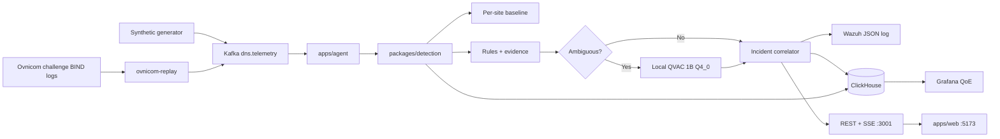

# Sentinel Adaptive

**Context-Aware DNS Intelligence at the Edge**

Sentinel Adaptive is a local, inspectable DNS security prototype for the Ovnicom / QVAC hackathon. It turns DNS telemetry into evidenced signals, merges compatible signals into incidents, and uses **local QVAC** only when a deterministic score is ambiguous.

It targets exactly two tracks:

- Track 03 — Sovereign Intelligence at the Edge
- Track 04 — Ovnicom Sentinel-DNS

This is a hackathon prototype, not a production IDS. It makes **no** detection-accuracy, SLA, customer-impact, or deployment-readiness claims. Every number in the UI comes from local ClickHouse, Wazuh, or the live agent store. Empty cells mean this machine has no stored row yet.

| Document | Contents |
| --- | --- |
| [docs/DEMO.md](docs/DEMO.md) | Five-minute operator recording script |
| [docs/ARCHITECTURE.md](docs/ARCHITECTURE.md) | Boundaries, failure behavior, API |
| [docs/COMPLIANCE.md](docs/COMPLIANCE.md) | Local-inference and data rules |
| [docs/DATA.md](docs/DATA.md) | Synthetic vs challenge-log fields |
| [docs/STATUS.md](docs/STATUS.md) | Stage checklist and last verified command |
| [docs/DESIGN_SYSTEM.md](docs/DESIGN_SYSTEM.md) | Operator UI tokens |
| [docs/DECISIONS.md](docs/DECISIONS.md) | Accepted ADRs |
| [docs/PREEXISTING.md](docs/PREEXISTING.md) | Third-party code and local-only weights |

## Why it exists

Track 04 needs a Sentinel-shaped DNS path: ingest, baseline, evidence, incidents, QoE, and a local SOC-style surface. Track 03 requires judged AI to run **on the machine**, not as a hosted chat API.

Sentinel Adaptive therefore splits work:

1. **Deterministic math** (`packages/detection`) extracts features, compares each fictional site with its own rolling baseline, and emits rule signals with named evidence.
2. **Local QVAC** (`@qvac/sdk` 0.19.0) reads only that evidence bundle when `0.60 ≤ score < 0.75`.
3. **Adapters** (`apps/agent`) own Kafka, ClickHouse, Wazuh, HTTP, and SSE.
4. **Presentation** (`apps/web`) fetches and renders. It does not run detection.

QVAC does not run once per DNS query. It cannot invent WHOIS, ASN, reputation, malware families, or external facts. Invalid JSON becomes `invalid`; a missing model becomes `unavailable`. Kafka and rule scoring continue either way.

## Sovereign inference

```text
@qvac/sdk 0.19.0
@qvac/inference 0.19.0
LLAMA_3_2_1B_INST_Q4_0
Quantization: Q4_0
QVAC_LOCAL_ONLY=true
```

There is no OpenAI, Anthropic, Gemini, Groq, Together, Fireworks, Replicate, or Hugging Face **inference** client. There is no cloud fallback. DHT / `startQVACProvider` / `.delegate(` patterns are forbidden and scanned by `npm run compliance`.

The first `loadModel` on a machine may download checksum-validated catalog weights (Windows registry lock can fail, so the agent may pass a catalog GGUF `fallbackSrc`). That download is **not** judged inference. Weights stay in `~/.qvac/models/` and are gitignored. After the file exists, later loads use that path. `npm run smoke:offline` was verified on this host: public HTTPS was unreachable, then a live local assessment returned schema-valid `consistent` JSON.

Prompted output is constrained to:

```json
{
  "assessment": "consistent | uncertain | insufficient_evidence",
  "rationale": "sentence-length text using only supplied evidence",
  "usedEvidence": ["metric", "..."],
  "confidence": "high | medium | low"
}
```

`confidence` is optional. A lone `high` / `medium` / `low` token is **not** treated as an operator explanation; the UI maps that token to Confidence.

Routing:

```text
score < 0.60          no signal emitted
0.60 ≤ score < 0.75   ambiguous → local QVAC
score ≥ 0.75          high-confidence → skip QVAC
```

## Judged flow



## Repository layout

| Path | Role |
| --- | --- |
| `packages/detection` | Pure, unit-tested features, baselines, rules, QoE, correlation, QVAC routing |
| `packages/contracts` | Zod schemas shared by agent, web, and generator |
| `apps/agent` | Kafka consumer, ClickHouse, Wazuh emit, QVAC runtime, operator API |
| `apps/web` | Vite + React operator UI (IBM Plex Sans, no detection math) |
| `tools/generator` | Deterministic synthetic DNS scenarios |
| `tools/ovnicom-replay` | BIND query-log replay onto the same Kafka topic |
| `infra` | Docker Compose for Kafka, ClickHouse, Grafana, Wazuh |
| `scripts` | Compliance, health, offline isolation, submission check |

## Detection (what the rules actually do)

Signals are only created at score `≥ 0.60`. Each signal keeps `source: "deterministic"` and a non-empty `evidence[]` of `{ metric, value, reason }`.

| Rule | Intent | Typical evidence |
| --- | --- | --- |
| Beaconing | Periodic queries to one dominant name | `interArrivalCv`, `queriesInWindow`, `dominantQname` |
| Tunneling | Long / high-entropy labels, TXT or unique-subdomain pressure | `longestLabelLength`, `longestLabelEntropy`, `uniqueSubdomainRate` |
| DGA | High NXDOMAIN + many unique names + lexical entropy | `nxdomainRatio`, `uniqueQnameRatio`, `longestLabelEntropy` |
| Typosquatting | Edit distance ≤ 2 vs a **local** canonical list | `qname`, `canonicalDomain`, `editDistance` |
| Baseline deviation | Site NXDOMAIN or latency p95 vs **that site’s** rolling stats (needs ≥ 10 prior windows) | current metric + `baselineMean` |

These are heuristic screens for the demo, not a claimed detector ROC.

Compatible signals on the **same site** in the same aligned **60-second** window share one `incidentId` (`INC-` + SHA-1 of `siteId|windowStart`). Member evidence is kept. Threat type and entity are recorded on the incident; they are not extra merge keys. Mixed `demo:combined` Kafka streams can dilute per-rule evidence, so correlation smokes use independently generated same-site attacks.

## Transparent QoE (not a detection score)

Completed **10-second** site windows persist in `sentinel.site_metrics`:

```text
availability  = 1 - nxdomainRatio
latencyFactor = clamp(siteBaselineLatencyP95 / currentLatencyP95, 0, 1)
capacity      = 1 - saturation
qoeScore      = 0.45 × availability + 0.35 × latencyFactor + 0.20 × capacity
```

Grafana dashboard: `sentinel-site-qoe`. For Ovnicom replay events, `latencyMs` and `saturation` are Sentinel enrichments, so those QoE components are synthetic.

## Data (what is and is not real)

Two sources share Kafka topic `dns.telemetry`. They are not the same kind of data.

**1. Ovnicom challenge BIND query logs** (local path, not in Git)

Parsed when present: timestamp (stored as UTC ISO-8601; timezone is an assumption), `clientIp`, `qname`, `qtype`, `resolverId`. Not in the logs: site, zone, latency, saturation, rcode/NXDOMAIN, attack labels. Replay fills those via `provenance.enrichedFields`, sets `source: "ovnicom-challenge"`, `synthetic: false`, and `rcode: NOERROR` (NXDOMAIN is never invented).

**2. Synthetic generator** (`tools/generator`)

Labeled scenarios only: `normal`, `beacon`, `ambiguous-beacon`, `tunnel`, `dga`, `typosquat`, `degrade-qoe`, `saturation`, `combined`. Events use `source: "sentinel-synthetic"`, `synthetic: true`, and fictional `.test` names.

Fictional sites with deliberately different normals:

- `PTY-BANK-01`
- `PTY-HEALTH-01`
- `COL-GOV-01`

## Operator UI and API

Default API: `http://127.0.0.1:3001` (`SENTINEL_API_PORT`). UI: `http://127.0.0.1:5173`.

| Method | Path | Purpose |
| --- | --- | --- |
| GET | `/api/system` | Tracks, `cloudInference: false`, QVAC pins, infra health |
| GET | `/api/overview` | Per-site latest QoE + recent incidents |
| GET | `/api/incidents` | Incident list |
| GET | `/api/incidents/:id` | Members, QVAC row, Wazuh emit/index, site window |
| GET | `/api/sites/:siteId` | Site windows and incidents |
| GET | `/api/events` | SSE incident / QVAC notifications |

Views: Overview, Incidents, Incident Detail, Site Detail, System / sovereignty.

## Five-minute demonstration

Prep is **outside** the five-minute clock (Docker, first GGUF download, seed). Follow [docs/DEMO.md](docs/DEMO.md).

```bash
npm run demo:seed
npm run agent:serve
npm run web:dev
```

Restart `agent:serve` after seeding if it was already running.

`demo:seed` writes real ClickHouse QoE windows and two deterministic incidents:

| Incident | Site | What to show |
| --- | --- | --- |
| `INC-1B41EDF624D62463` | `PTY-BANK-01` | High-confidence DGA + beacon; QVAC **skipped** |
| `INC-1AC334C9BD19C07D` | `PTY-HEALTH-01` | Weak beacon ≈ 0.72; local QVAC **assessed** |

If ids differ, use the API. Do not invent a rationale; 1B Q4_0 text can vary and may be `invalid`.

Spoken only in the video (do not re-run during the five minutes): `npm run smoke:offline` blocked `https://example.com` and still produced a schema-valid local assessment.

## Local infrastructure

| Service | Typical URL / port |
| --- | --- |
| Kafka | `localhost:9092` (topic `dns.telemetry`) |
| ClickHouse | `http://localhost:8123` database `sentinel` |
| Grafana | `http://localhost:3000` |
| Wazuh dashboard | `https://localhost:5601` |
| Wazuh indexer | `https://localhost:9200` |
| Wazuh event log | `infra/wazuh/runtime/events.json` (not committed) |

Copy `.env.example` to `.env`. Default Compose passwords in that file are **local demo only**.

```bash
npm install
cp .env.example .env
npm run infra:up
npm run health
```

Requirements: Node.js ≥ 22.17, npm ≥ 10.9, Docker Compose.

## Commands

**Quality**

```bash
npm run typecheck
npm run test
npm run lint
npm run compliance
npm run submission
```

**Smokes** (need the matching local service or cached GGUF)

```bash
npm run smoke:infra
npm run smoke:generator
npm run smoke:detection
npm run smoke:qoe
npm run smoke:wazuh
npm run smoke:qvac
npm run smoke:offline
npm run smoke:correlation
npm run smoke:ui
npm run smoke:ovnicom
```

`smoke:offline` requires Administrator on Windows: it blocks public outbound IPv4/IPv6, proves a public HTTPS fetch fails, runs live QVAC from the cached GGUF, then removes the rules. Loopback and RFC1918 stay reachable. If the process dies mid-run:

```powershell
powershell -ExecutionPolicy Bypass -File .\scripts\windows-offline-net.ps1 -Action remove
```

**Traffic**

```bash
npm run demo:normal
npm run demo:beacon
npm run demo:ambiguous-beacon
npm run demo:dga
npm run demo:tunnel
npm run demo:typosquat
npm run demo:degrade-qoe
npm run demo:saturation
npm run demo:combined
npm run ovnicom:replay -- --limit 10000 --dry-run
```

Generator default seed is `424242` and event origin `2026-09-10T12:00:00.000Z` unless overridden. `--dry-run` prints NDJSON without Kafka.

## Failure behavior

- Invalid or missing QVAC does not stop Kafka consumption.
- ClickHouse, Wazuh log, and incident persist failures are logged and do not crash the consumer.
- The original deterministic signal is not rewritten by QVAC.
- Chain-of-thought is not stored (`captureThinking: false`).

## Limitations

- Heuristic rules on synthetic and challenge-replay traffic, not a measured production detector
- 1B Q4_0 JSON quality varies; schema validation fails closed
- First model download can take several minutes
- Beacon spacing is 15s; six events can cross a 60s correlation window
- Incidents persisted before signal rows existed will lack member evidence until new traffic is processed
- Challenge-log QoE latency/saturation components are synthetic enrichments
- No Pears / DHT delegated inference
