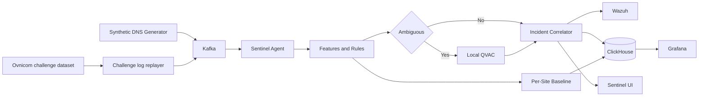

# Sentinel Adaptive

**Context-Aware DNS Intelligence at the Edge**

Sentinel Adaptive turns DNS telemetry into evidenced, correlated incidents. It compares each fictional site with that site’s own baseline, emits inspectable rule evidence, and uses **local QVAC** only when the deterministic score is ambiguous.

The project targets exactly two tracks:

- Track 03 — Sovereign Intelligence at the Edge
- Track 04 — Ovnicom Sentinel-DNS

It is a hackathon prototype, not a production IDS. It makes no detection-accuracy, SLA, or customer-impact claims.

## Sovereign inference

Judged AI inference runs only through in-process QVAC:

```text
@qvac/sdk 0.19.0
@qvac/inference 0.19.0
LLAMA_3_2_1B_INST_Q4_0
Quantization: Q4_0
```

There is no cloud inference provider, remote inference endpoint, or cloud fallback. QVAC receives structured evidence bundles for scores in `[0.60, 0.75)` and does not run once per DNS query. After the GGUF is cached, `npm run smoke:offline` proves a live assessment still succeeds with public outbound internet disabled.

## Judged flow



## What is implemented

- Synthetic Kafka scenarios for three fictional sites (`PTY-BANK-01`, `PTY-HEALTH-01`, `COL-GOV-01`)
- Replay of the Ovnicom challenge BIND query logs onto the same `dns.telemetry` topic, with missing contract fields marked as local enrichment
- Deterministic features, per-site baselines, rules, and evidence-bearing signals
- Transparent site QoE in ClickHouse and Grafana (`0.45` availability / `0.35` latency / `0.20` capacity)
- Correlated incidents persisted with member evidence and optional QVAC rows
- Wazuh ingestion of one `dns_security_incident` line per incident
- Operator UI: Overview, Incidents, Incident Detail, Site Detail, System
- Offline local-inference proof after the model is on disk

## Five-minute demonstration

Prep is outside the five-minute clock (Docker infra, first GGUF download if needed, then seed). The recording script is [docs/DEMO.md](docs/DEMO.md).

Once infra is healthy and the model is cached:

```bash
npm run demo:seed
npm run agent:serve
npm run web:dev
```

Open `http://127.0.0.1:5173`. Restart `agent:serve` after seeding if the API was already running.

`demo:seed` writes real ClickHouse QoE windows, a high-confidence DGA + beacon incident on `PTY-BANK-01` (QVAC skipped), and a weak-beacon incident on `PTY-HEALTH-01` that local QVAC actually assesses. It does not invent metrics or rationale text.

## Requirements

- Node.js 22.17 or newer
- npm 10.9 or newer
- Docker with Compose for Kafka, ClickHouse, Grafana, and Wazuh

```bash
npm install
cp .env.example .env
npm run infra:up
npm run health
```

First `loadModel` may download `LLAMA_3_2_1B_INST_Q4_0`. Weights stay in `~/.qvac/models/` and are not committed.

## Checks

```bash
npm run typecheck
npm run test
npm run lint
npm run compliance
npm run submission
npm run smoke:qvac
npm run smoke:offline
npm run smoke:ui
```

`smoke:offline` needs Administrator rights on Windows so it can block public outbound internet, then restore the rules.

Challenge-log replay (local path via `OVNICOM_DATASET_PATH` or `--path`):

```bash
npm run ovnicom:replay -- --limit 10000 --dry-run
npm run smoke:ovnicom
```

## Data

Only repository-generated synthetic telemetry and the challenge-provided BIND query logs are used. The logs are not treated as customer or production telemetry. See [docs/DATA.md](docs/DATA.md).

## Documentation

- [Build plan](docs/BUILD_PLAN.md)
- [Status](docs/STATUS.md)
- [Architecture](docs/ARCHITECTURE.md)
- [Compliance](docs/COMPLIANCE.md)
- [Demo script](docs/DEMO.md)
- [Pre-existing components](docs/PREEXISTING.md)
