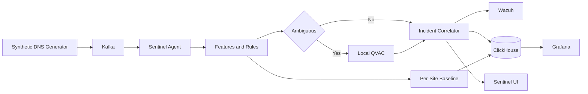

# Sentinel Adaptive

**Context-Aware DNS Intelligence at the Edge**

Sentinel Adaptive is a hackathon project for turning synthetic DNS telemetry into contextual, explainable security incidents. The planned system compares behavior with each site's own baseline, correlates related signals, and uses local QVAC inference to assess ambiguous evidence.

> Tracks: Track 03 — Sovereign Intelligence at the Edge and Track 04 — Ovnicom Sentinel-DNS

## Sovereign by design

The runtime architecture permits judged AI inference only through local QVAC:

```text
@qvac/sdk 0.19.0
@qvac/inference 0.19.0
LLAMA_3_2_1B_INST_Q4_0
```

No cloud AI inference path is part of the design. Only synthetic or documented public data may be used.

## Planned judged flow



## Current status

Stage 0 repository scaffolding and compliance guardrails are complete. Streaming, detection, infrastructure, QVAC inference, and the operator UI are not implemented yet.

See [the build plan](docs/BUILD_PLAN.md), [current status](docs/STATUS.md), and [compliance boundary](docs/COMPLIANCE.md).

## Development

Requirements:

- Node.js 22.17 or newer
- npm 10.9 or newer
- Docker with Compose for later infrastructure stages

```bash
npm install
npm run typecheck
npm run test
npm run lint
npm run compliance
```

## Limitations

This is an unfinished hackathon prototype. It is not a production IDS and currently makes no claims about detection accuracy, performance, or deployment readiness.
