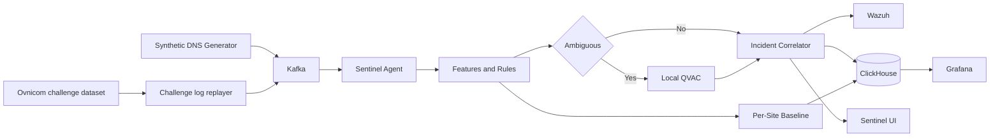

# Sentinel Adaptive

**Context-Aware DNS Intelligence at the Edge**

Sentinel Adaptive is a hackathon project for turning DNS telemetry into contextual, explainable security incidents. The planned system compares behavior with each site's own baseline, correlates related signals, and uses local QVAC inference to assess ambiguous evidence.

Sentinel Adaptive replays the DNS dataset supplied with the Ovnicom challenge as a live Kafka stream and combines it with controlled synthetic security scenarios for reproducible evaluation. The challenge files are BIND query logs from the challenge materials; this repository does not treat them as customer or production telemetry.

> Tracks: Track 03 — Sovereign Intelligence at the Edge and Track 04 — Ovnicom Sentinel-DNS

## Sovereign by design

The runtime architecture permits judged AI inference only through local QVAC:

```text
@qvac/sdk 0.19.0
@qvac/inference 0.19.0
LLAMA_3_2_1B_INST_Q4_0
```

No cloud AI inference path is part of the design. Only synthetic or documented public data may be used.

## Planned judged flow



## Current status

Stages 0–8 are complete locally: infrastructure smoke, synthetic Kafka scenarios, detection, Ovnicom challenge replay, ClickHouse QoE, local QVAC assessment of ambiguous candidates, correlated incidents emitted to Wazuh and ClickHouse, and a presentation-only operator UI against the local agent API.

See [the build plan](docs/BUILD_PLAN.md), [current status](docs/STATUS.md), [data sources](docs/DATA.md), and [compliance boundary](docs/COMPLIANCE.md).

Challenge dataset replay (local path via `OVNICOM_DATASET_PATH` or `--path`):

```bash
npm run ovnicom:replay -- --limit 10000 --dry-run
npm run smoke:ovnicom
npm run smoke:qoe
npm run smoke:wazuh
npm run smoke:qvac
npm run smoke:correlation
npm run smoke:ui
```

Operator UI (local API on port 3001, Vite dev server on 5173):

```bash
npm run agent:serve
npm run web:dev
```

## Development

Requirements:

- Node.js 22.17 or newer
- npm 10.9 or newer
- Docker with Compose for later infrastructure stages

```bash
npm install
npm run typecheck
npm run test
npm run lint
npm run compliance
```

## Limitations

This is an unfinished hackathon prototype. It is not a production IDS and currently makes no claims about detection accuracy, performance, or deployment readiness.
