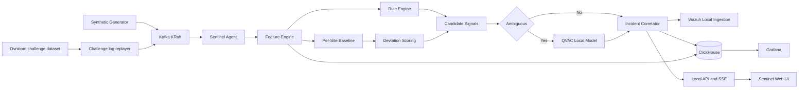

# Architecture

## Goal

Sentinel Adaptive will process synthetic DNS telemetry locally, compare observations with per-site behavior, correlate evidence into incidents, and use QVAC only for ambiguous assessments.

## Repository boundaries

- `apps/agent`: streaming and infrastructure adapters, QVAC, incidents, REST, and SSE
- `apps/web`: operator presentation only
- `packages/contracts`: shared runtime and TypeScript contracts
- `packages/detection`: pure detection, baseline, correlation, severity, and QoE functions
- `tools/generator`: deterministic synthetic scenarios
- `tools/ovnicom-replay`: streaming parser for the Ovnicom challenge BIND query logs
- `infra`: reproducible local infrastructure configuration

## Inference boundary

All judged inference must execute locally through `@qvac/sdk` and `@qvac/inference` 0.19.0 using `LLAMA_3_2_1B_INST_Q4_0`. QVAC receives structured derived evidence only, and only for scores in `[0.60, 0.75)`. It cannot invent or fetch reputation, WHOIS, ownership, ASN, or malware-family data. The original deterministic signal is not mutated.

## Failure behavior

Kafka processing and deterministic metrics must continue if QVAC is unavailable or returns invalid JSON. Model output is schema-validated before use. Raw signals remain available after incident correlation. ClickHouse write failures are logged and must not stop Kafka consumption. Wazuh log write failures and QVAC assessment failures are logged the same way.

## Transparent QoE

Site QoE is a weighted combination of availability (`1 - nxdomainRatio`), latency versus that site's own p95 baseline, and unused capacity (`1 - saturation`). Weights are 0.45 / 0.35 / 0.20. The score is stored with its components in ClickHouse and shown on the provisioned Grafana dashboard `sentinel-site-qoe`. It is not a detection score.

## Current implementation state

Stages 0–6 are operational locally: infrastructure smoke, synthetic Kafka telemetry, per-site detection baselines, challenge-dataset replay, ClickHouse persistence of DNS events and site windows, a Grafana dashboard for transparent QoE, Wazuh ingestion of uncorrelated detection signals, and local QVAC assessment of ambiguous evidenced candidates. Incident correlation and the UI remain later stages and must not be described as complete.
