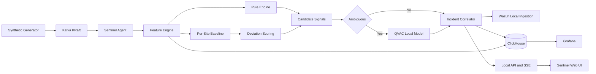

# Architecture

## Goal

Sentinel Adaptive will process synthetic DNS telemetry locally, compare observations with per-site behavior, correlate evidence into incidents, and use QVAC only for ambiguous assessments.

## Repository boundaries

- `apps/agent`: streaming and infrastructure adapters, QVAC, incidents, REST, and SSE
- `apps/web`: operator presentation only
- `packages/contracts`: shared runtime and TypeScript contracts
- `packages/detection`: pure detection, baseline, correlation, severity, and QoE functions
- `tools/generator`: deterministic synthetic scenarios
- `infra`: reproducible local infrastructure configuration

## Inference boundary

All judged inference must execute locally through `@qvac/sdk` and `@qvac/inference` 0.19.0 using `LLAMA_3_2_1B_INST_Q4_0`. QVAC receives structured derived evidence only. It cannot invent or fetch reputation, WHOIS, ownership, ASN, or malware-family data.

## Failure behavior

Kafka processing and deterministic metrics must continue if QVAC is unavailable or returns invalid JSON. Model output is schema-validated before persistence. Raw signals remain available after incident correlation.

## Current implementation state

Only Stage 0 scaffolding exists. The runtime flow shown above is planned and must not be represented as operational until later acceptance tests pass.
